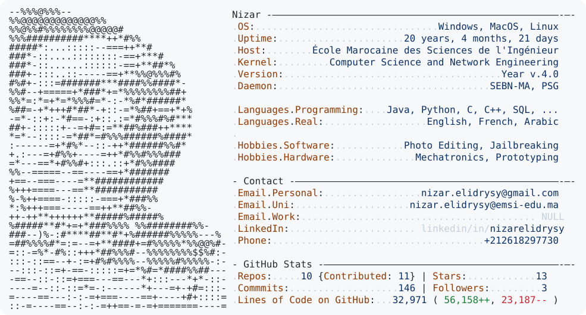

<picture>
  <source media="(prefers-color-scheme: dark)" srcset="dark_mode.svg">
  <source media="(prefers-color-scheme: light)" srcset="light_mode.svg">
  
</picture>

---

**CS & Network Engineering Student @ EMSI - Ambassador @ Career Center EMSI**

---

# Technical Skills

| Category | Technologies & Tools |
| :--- | :--- |
| **Network & Protocols** | DNS, TCP/IP, OSI Diagram, HDLC/PPP/UDP Protocoles, Ipv4/Ipv6 Adressing, Routing, Coding |
| **Programming** | C, C++, Java, PHP, Python, JavaScript, TypeScript, SQL, HTML/CSS, GRAFCET, GEMMA, Bash, Arduino |
| **Software & Tools** | Git/GitHub, XAMPP, Packet Tracer, CoolTerm, MATLAB, Proteus ISIS, Fritzing, TinkerCad, AutomGen, Adobe CC, MS Office, WireShark, Zotero, SSMS/SQL Server, draw.io, ECLIPSE IDE, SPYDER IDE |
| **Diagrams & Modeling** | Classes, Activity, Use Case, Sequence, State Machine, Package, Deployment, Components, Communication, MCC, MCD |
| **OS** | Windows, MacOS, Linux (Debian) |

---

# Contact Me

* **Location:** Morocco (Open Geographically)
* **Phone:** [+212618297730](https://api.whatsapp.com/send?phone=212618297730)
* **Email:** [nizar.elidrysy@emsi-edu.ma](mailto:nizar.elidrysy@emsi-edu.ma) | [nizar.elidrysy@gmail.com](mailto:nizar.elidrysy@gmail.com)
* **LinkedIn:** [linkedin.com/in/nizarelidrysy](https://linkedin.com/in/nizarelidrysy)
* **Portfolio (Google sites):** [sites.google.com/nizarelidrysy](https://sites.google.com/view/nizarelidrysy/home)
* **Portfolio (GitHub):** [nizarelidrysy.github.io/Portfolio-Website](https://nizarelidrysy.github.io/Portfolio-Website/)
